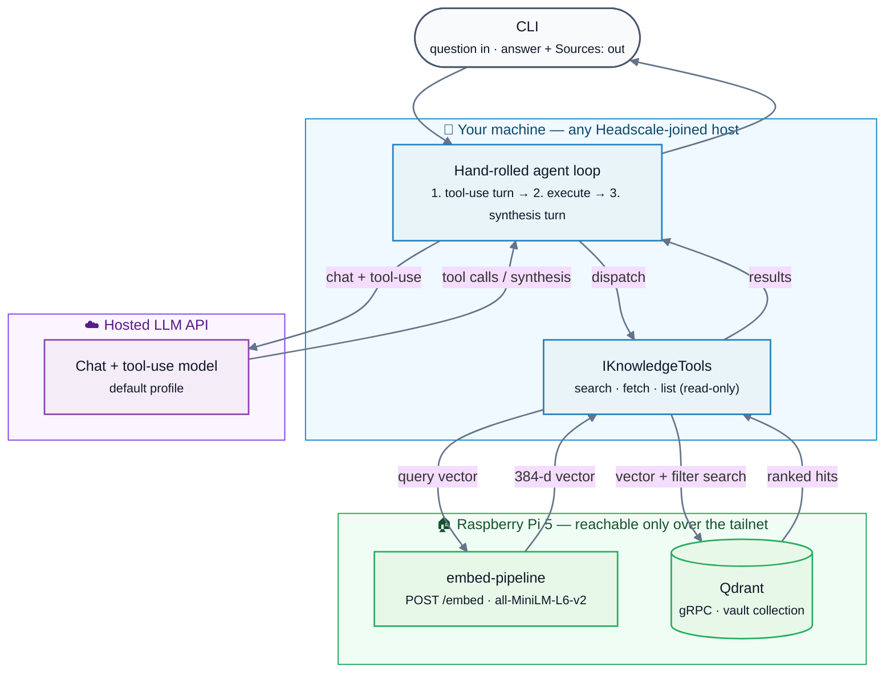

# agentic-rag

A .NET-based agentic RAG system for personal knowledge retrieval over an indexed
Obsidian vault.

Unlike plain RAG pipelines, the agent dynamically chooses retrieval strategies —
semantic search, metadata filtering, direct note fetches, or temporal queries —
and can chain retrieval calls before synthesizing an answer with citations.

The tool surface is source-agnostic by design. v0.5 ships with the Obsidian vault
as the only source; additional sources are added by indexing them into the same
store under a `source` tag — the tool surface doesn't change.

## Architecture (v0.5)



The agent owns orchestration and synthesis. It owns no data: query vectors come
from the same embed-pipeline that built the index, and retrieval hits come from a
Qdrant collection populated by that pipeline. Both run on a Raspberry Pi and are
reachable only over the Headscale tailnet. The default profile is a hosted LLM
API; vault chunks travel to it as tool results. Which provider, and why, is in
*The two LLM profiles* below.

## What v0.5 does

Four read tools, exposed to the model as JSON-schema functions:

- **`search_knowledge`** — semantic search over the index, with optional `tags`,
  `type`, and `folders` filters. Returns ranked hits with the chunk body.
- **`get_note_by_path`** — fetch a full note by vault-relative path.
  Reconstructed from indexed chunks, not read from disk (see *Data layer*).
- **`search_by_tag_or_type`** — filter-only listing, no semantic query. Results
  are not relevance-ranked; the model is told not to infer importance from order.
- **`list_recent_daily_notes`** — daily notes from the last N days, newest first.

The loop is one question in, one synthesised answer out — no REPL, no history
across invocations. It runs a tool-use turn, executes any requested calls, feeds
the results back, and repeats until the model answers in prose or a five-turn
budget forces synthesis. When the answer draws on retrieved notes it ends with a
`Sources:` block, one `- [Title] (path)` line per note, deduplicated by path.

A worked example. The point is structural: the answer is built from retrieved
chunks, not the model's priors — note the specific model name, the reuse
rationale, and the named-vector constraint, all lifted from the indexed notes,
and the `Sources:` line pointing back at them. Output trimmed to the first item;
the synthesis style is the LLM's, not the project's.

```
$ dotnet run --project src/AgenticRag -- "what did I decide about embedding models"
# ... structured HTTP logs on stdout elided ...
You decided the following about embedding models in your **agentic-rag** project:

1. **Flagship Model**:
   - **Model**: `sentence-transformers/all-MiniLM-L6-v2`
   - **Rationale**: Reuse the existing pipeline and Qdrant collection, which is already indexed with this model at section-level granularity. This avoids unnecessary rebuilding and maintains consistency.
   - **Constraint**: The Qdrant collection uses a named vector (`fast-all-minilm-l6-v2`), so any query must specify this vector name to avoid errors.

# ... items 2–4 (spike model, query embedding, tailnet binding) elided ...

### Sources:
- [Decisions](projects/agentic-rag/index.md)
```

## What v0.5 does not do

No ingestion of any additional source — the vault is the only index. No
write-back — every tool is read-only. No MCP
server mode. No multi-step query reformulation beyond what one loop's worth of tool
calls covers. No scheduled jobs, no inbox watcher. No observability or tracing. No
web UI — the interface is the CLI. These are v0.5's boundaries, listed so the scope
is unambiguous.

## The two LLM profiles

The agent loop talks to an `IChatClient` and never learns which profile is active.
Two are wired:

- **Mistral API (default)** — `mistral-medium-latest` via Mistral's
  EU-jurisdictional endpoint. Vault chunks travel to Mistral as tool results. This
  is a "your infrastructure + an EU-jurisdiction LLM" data story, not a
  fully-local one — accurate framing matters more than a cleaner claim.
- **Pi-Ollama (fallback)** — `qwen2.5:3b` on a Raspberry Pi 5. Fully local;
  nothing leaves the tailnet. It is the demonstrably offline-capable path, not the
  daily driver — query latency is around 45 seconds.

Real measurements, not extrapolation:

| Path | Single-turn tool call | Two-turn end-to-end query |
|---|---|---|
| Mistral `mistral-medium-latest` | 0.44–2.56s (typically ~0.5–0.8s) | ~8s |
| qwen2.5:3b on Pi 5 (8GB) | 10–32s | ~45s |

*From a five-prompt tool-use suite: qwen2.5:3b on Pi 5 (2026-04-24) and
`mistral-medium-latest` via API (2026-05-17). The upper end of the Mistral range
is a cold-start; subsequent calls land sub-second.*

Switching profiles is one key in `appsettings.json`, no code change — the loop
only ever sees the `IChatClient` abstraction:

```json
{
  "Llm": {
    "Profile": "ollama"   // "mistral" (default) | "ollama"
  }
}
```

## Requirements to run it

v0.5 is built to run against a specific home-lab setup, and the list below
reflects that honestly rather than hiding it. Forking the work means standing up
the equivalent components — chiefly the embed-pipeline and an indexed Qdrant
collection (see *Dependencies*).

- **.NET 10 SDK.**
- **A Mistral API key**, in the `MISTRAL_API_KEY` environment variable (for the
  default profile).
- **A Headscale-joined host.** The embed-pipeline `/embed` endpoint and Qdrant are
  bound to the Pi's tailnet IP only. The agent must run on a machine joined to the
  mesh — this is a hard constraint, not a convenience.
- **The embed-pipeline running and reachable.** It produces query vectors with the
  same model that built the index. It is a separate component, not part of this
  repo.
- **A Qdrant collection with content already indexed**, in the payload shape below.
  Also produced by the separate embed-pipeline.
- **Pi-Ollama profile only:** `ollama` on a tailnet host with `qwen2.5:3b` pulled.

Endpoints come from `appsettings.json`, overridable by a gitignored
`appsettings.Development.json` or `AGENTICRAG_`-prefixed environment variables.
`MISTRAL_API_KEY` and `QDRANT_API_KEY` are read from the environment so keys can
rotate without editing config.

## The data layer dependency

This agent queries an index it does not build. The embed-pipeline that produces
that index is a **separate repository** and a hard prerequisite. The contract
between them is the Qdrant payload: every point carries `file`, `title`,
`chunk_index`, `tags`, `type`, `folders`, `source`, a `heading`, and the chunk
body. The collection uses a named vector (`fast-all-minilm-l6-v2`) over gRPC.

The `file` payload key is a cross-system contract. The agent reads it to group and
fetch notes; the embed-pipeline writes and filters on it, including its
delete-by-file reindex dedup. Rename it on either side and the other breaks
silently — flag this before forking the work.

Because there is no filesystem access, `get_note_by_path` reconstructs a note from
its indexed chunks and rebuilds frontmatter from payload fields. Original YAML
formatting and non-indexed keys are not preserved. This is fine for feeding
context to an LLM; it is *not* a fidelity-preserving read of the on-disk note.

## Architecture decisions worth flagging

**Source-agnostic tool surface, vault-only index.** The search tool is
`SearchKnowledge` with a `sources` filter, not `SearchVault`, even though the vault
is the only thing indexed today. Per-source tools (`search_vault`,
`search_bookmarks`, …) are a fan-out anti-pattern: the agent ends up choosing
which source to query instead of the system unifying retrieval.

**Query vectors come from the embed-pipeline's HTTP endpoint.** Query and index
vectors must come from the same model or similarity scores are meaningless. Rather
than load `sentence-transformers` into the .NET process — a ~90MB model, an
ONNX conversion step, and a second copy of a service that already runs — the agent
calls the pipeline's `/embed` endpoint and gets bit-identical vectors. The drift
question disappears instead of being verified away.

**Hand-rolled agent loop, no Semantic Kernel.** Four tools, one provider with one
fallback, a single-turn CLI, no cross-conversation state. SK's tool-registration
and orchestration abstractions buy nothing at this scope, and the rest of the
codebase already talks to Qdrant and HTTP directly. SK would earn its weight at
a scope this project doesn't reach: multi-step retrieval, multi-provider routing,
or exposing the tools as an MCP server.

**Mistral default, Pi-Ollama as a profile.** The project's thesis is self-reliant
infrastructure, which argues for the local model. But 45-second queries make a
tool a demo, not something used daily, and "actually used" was weighted above
thesis purity. Mistral closes the latency gap ~15–20× and is EU-jurisdictional,
preserving a defensible data-sovereignty story; keeping Pi-Ollama as a one-config
switch preserves the offline path without keeping dead code.

## Dependencies

**embed-pipeline** — a separate service, not part of this repo and a hard runtime
prerequisite. It chunks the vault at `##`-section granularity, embeds each chunk
with `sentence-transformers/all-MiniLM-L6-v2`, and owns the Qdrant collection this
agent queries — including the `/embed` endpoint that produces query vectors and
the delete-by-file reindex that keeps the collection consistent. This agent reads
that collection; it never writes to it.

## License

MIT — see [LICENSE](LICENSE).
