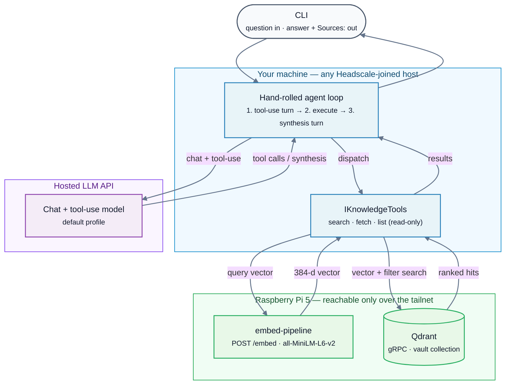

# agentic-rag

A .NET agent that answers questions over my own notes, on my own infrastructure.
The index and the retrieval stay inside a private network; the only data that
crosses the perimeter is the handful of chunks sent to the model that writes the
answer — and which model that is, is a config value: an EU-jurisdiction API by
default, a fully local model one setting away.

It is the reference implementation for *Geography Is Not Jurisdiction*, a series
on what on-premises and EU-jurisdiction AI actually mean for regulated
organisations:

- [Part 1 — Why your AI pilot shouldn't leave the EU](https://stefandango.dev/eu-ai-jurisdiction-part-1-why-it-shouldnt-leave-the-eu/)
- [Part 2 — What "on-premises AI" actually means in 2026](https://stefandango.dev/eu-ai-jurisdiction-part-2-what-on-premises-actually-means/)
- [Part 3 — The generation boundary](https://stefandango.dev/eu-ai-jurisdiction-part-3-the-generation-boundary/) — this repo, as the architecture
- [Your tool catalogue is your data-flow specification](https://stefandango.dev/building-a-personal-ai-assistant-for-my-notes/) — the retrieval contract

## Why it's built this way

**The tier is chosen at the generation boundary, and the boundary is an
abstraction.** The agent loop talks to an `IChatClient` and never learns which
backend answered. One config key moves the system between an EU-jurisdiction API
(retrieved chunks leave the perimeter, to an EU legal entity) and a local model on
the same tailnet (nothing leaves). Vendor, model and hardware inside each profile
are config too. The same single crossing is the one place an audit log would live.

**One source-agnostic retrieval tool, not one tool per source.** The search tool
is `SearchKnowledge` with a `sources` filter, not `SearchVault`. Per-source tools
make the model the router and split the data-flow contract across signatures;
one tool keeps what can be retrieved, from where, auditable from a single
signature. New sources are indexed under a `source` tag; the tool surface does
not change.

**The agent owns no data.** Query vectors come from the same embed-pipeline that
built the index, over HTTP, so query and index vectors are bit-identical by
construction — the drift question disappears instead of being verified away.
The pipeline and the Qdrant collection run on a Raspberry Pi reachable only over a
Headscale tailnet.

## Architecture



## What it does

Four read-only tools, exposed to the model as JSON-schema functions:

- **`search_knowledge`** — semantic search over the index, with optional `tags`,
  `type` and `folders` filters. Returns ranked hits with the chunk body.
- **`get_note_by_path`** — a full note by vault-relative path, reconstructed from
  indexed chunks rather than read from disk (see *Running it*).
- **`search_by_tag_or_type`** — filter-only listing, no semantic query. Results
  are not relevance-ranked, and the model is told not to infer importance from order.
- **`list_recent_daily_notes`** — daily notes from the last N days, newest first.

One question in, one synthesised answer out. The loop runs a tool-use turn,
executes the requested calls, feeds the results back, and repeats until the model
answers in prose or a five-turn budget forces synthesis. Answers that draw on
retrieved notes end with a `Sources:` block, one line per note, deduplicated by
path.

A worked example. The point is structural: the specific model name, the reuse
rationale and the named-vector constraint are lifted from the indexed notes, not
the model's priors, and the `Sources:` line points back at them.

```text
$ dotnet run --project src/AgenticRag -- "what did I decide about embedding models"
You decided the following about embedding models in your **agentic-rag** project:

1. **Flagship Model**:
   - **Model**: `sentence-transformers/all-MiniLM-L6-v2`
   - **Rationale**: Reuse the existing pipeline and Qdrant collection, which is already indexed with this model at section-level granularity. This avoids unnecessary rebuilding and maintains consistency.
   - **Constraint**: The Qdrant collection uses a named vector (`fast-all-minilm-l6-v2`), so any query must specify this vector name to avoid errors.

# ... items 2–4 elided ...

### Sources:
- [Decisions](projects/agentic-rag/index.md)
```

## The two LLM profiles

- **Mistral API (default)** — `mistral-medium-latest` via Mistral's
  EU-jurisdiction endpoint. Retrieved chunks travel to Mistral as tool results.
  This is a "your infrastructure plus an EU-jurisdiction model" data story, not a
  fully local one — accurate framing matters more than a cleaner claim.
- **Pi-Ollama (fallback)** — `qwen2.5:3b` on a Raspberry Pi 5. Fully local;
  nothing leaves the tailnet. The offline-capable path, not the daily driver.

Measured, not extrapolated:

| Path                            | Single-turn tool call            | Two-turn end-to-end query |
| ------------------------------- | -------------------------------- | ------------------------- |
| Mistral `mistral-medium-latest` | 0.44–2.56s (typically ~0.5–0.8s) | ~8s                       |
| qwen2.5:3b on Pi 5 (8GB)        | 10–32s                           | ~45s                      |

*From a five-prompt tool-use suite: qwen2.5:3b on Pi 5 (2026-04-24) and
`mistral-medium-latest` via API (2026-05-17). The upper end of the Mistral range is
a cold start.*

The 45 seconds is a fact about a 3B model on a Pi's CPU, not about local inference:
pointing the local profile at a GPU workstation is an address change. The default
is the API because "actually used" was weighted above thesis purity, and the
fallback stays wired for the data class where nothing may leave.

Switching is one key in `appsettings.json`:

```json
{
  "Llm": {
    "Profile": "ollama"
  }
}
```

`"mistral"` is the default; `"ollama"` selects the local profile.

## Status and scope

This repository is deliberately frozen at v0.5, the version the articles above
describe, so the code and the writing stay in step. It has no write-back, no
ingestion of further sources, no MCP server mode, no scheduled jobs and no web UI.
Those boundaries are the scope, not a roadmap.

`experiments/prompt-injection/` holds three reproducible experiments against real
before-and-after code, written up in
[The best fix for prompt injection was deleting the agent](https://stefandango.dev/prompt-injection-deleting-the-agent/).

The system has kept running and growing since, in private repositories. The
retrieval tools now run as a standalone MCP server, collapsed into a single
filtered search tool; a Go ingestion service adds a second source to the same
index under a `source` tag without changing the tool surface; and changes to
chunking or embedding are gated by a retrieval eval with a recorded baseline,
against an embedding path pinned down to the model revision.

## Running it

v0.5 runs against a specific home-lab setup, and the requirements say so rather
than hide it. Forking it means standing up the equivalent data layer.

- **.NET 10 SDK.**
- **A Mistral API key** in `MISTRAL_API_KEY`, for the default profile.
- **A Headscale-joined host.** The embed-pipeline and Qdrant are bound to the Pi's
  tailnet IP only; the agent must run on a machine in the mesh.
- **The embed-pipeline**, running and reachable — a separate repository and a hard
  prerequisite. It chunks the vault at `##`-section granularity, embeds with
  `sentence-transformers/all-MiniLM-L6-v2`, owns the Qdrant collection, and serves
  the `/embed` endpoint for query vectors.
- **An indexed Qdrant collection** in the payload shape below.
- **Pi-Ollama profile only:** `ollama` on a tailnet host with `qwen2.5:3b` pulled.

Endpoints come from `appsettings.json`, overridable by a gitignored
`appsettings.Development.json` or `AGENTICRAG_`-prefixed environment variables.
`MISTRAL_API_KEY` and `QDRANT_API_KEY` are read from the environment so keys can
rotate without editing config. Tests: `dotnet test`.

**The data contract.** Every Qdrant point carries `file`, `title`, `chunk_index`,
`tags`, `type`, `folders`, `source`, a `heading` and the chunk body; the collection
uses a named vector (`fast-all-minilm-l6-v2`) over gRPC. The `file` key is a
cross-system contract: the agent reads it to group and fetch notes, and the
embed-pipeline writes and filters on it, including the delete-by-file step that
keeps re-indexing free of orphan chunks. Rename it on either side and the other
breaks silently.

Because the agent has no filesystem access, `get_note_by_path` rebuilds a note from
its chunks and its frontmatter from payload fields. Original YAML formatting and
non-indexed keys are lost — fine for feeding context to a model, not a faithful
read of the note on disk.

**Hand-rolled loop, no Semantic Kernel.** Four tools, one provider with one
fallback, a single-turn CLI and no cross-conversation state: Semantic Kernel's
abstractions buy nothing at this scope, and the rest of the codebase talks to
Qdrant and HTTP directly.

## License

MIT — see [LICENSE](LICENSE).
